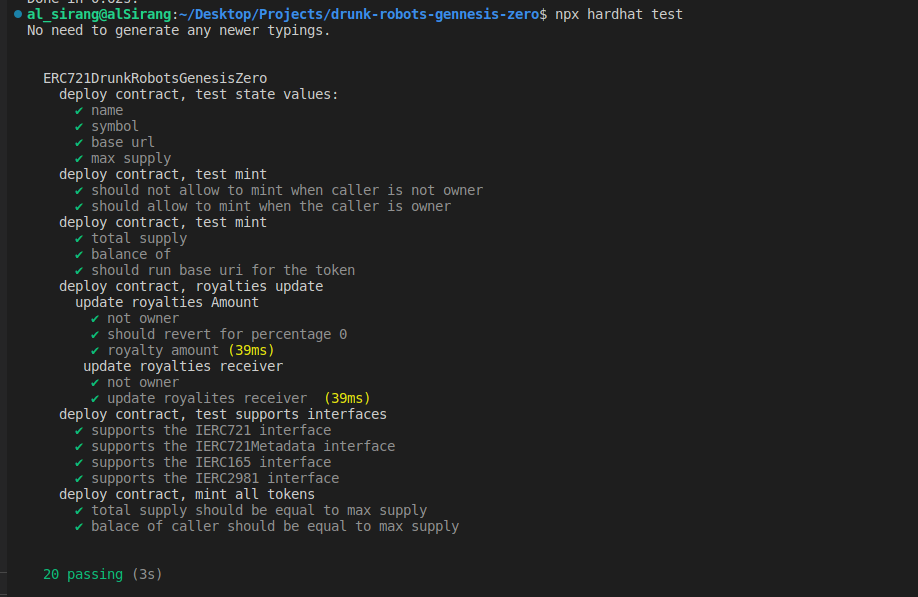

# ERC721 Drunk Robots Genesis Zero Contract

ERC721 collection for Drunk Robots Genesis Zero NFTs. It has maximum supply of 50 NFTs. Only the NFT owner aka deployer will be able to mint NFTs for any address.

## Commands available to run

You can run the following commands in the root directory.

### yarn install or yarn

Run `yarn install` or `yarn` to install the dependencies.

### npx hardhat compile

Run `npx hardhat compile` to create artifacts.

### npx hardhat test

Run `npx hardhat test` to execute tests scripts.

## Test Coverage

The following image shows the test outputs.

